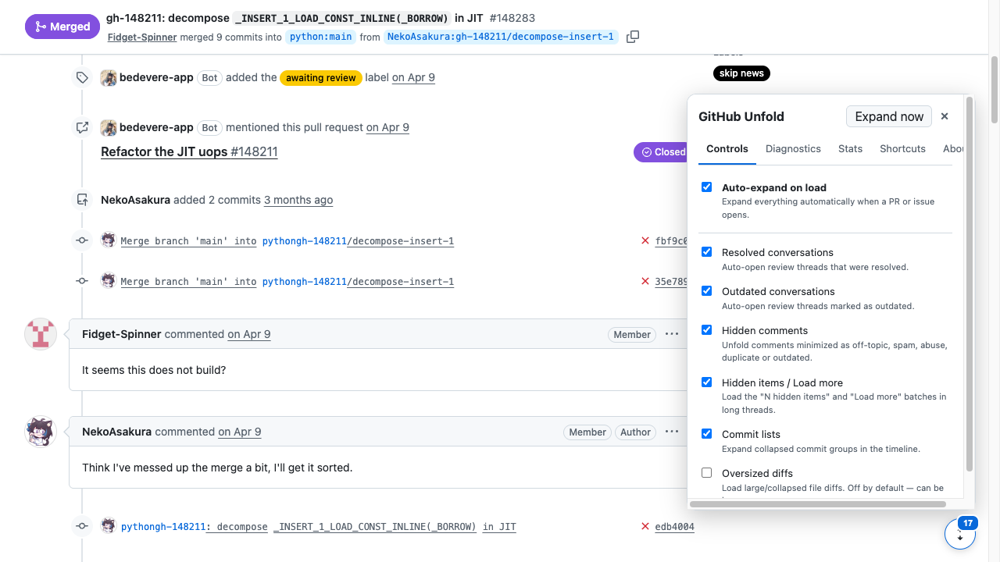
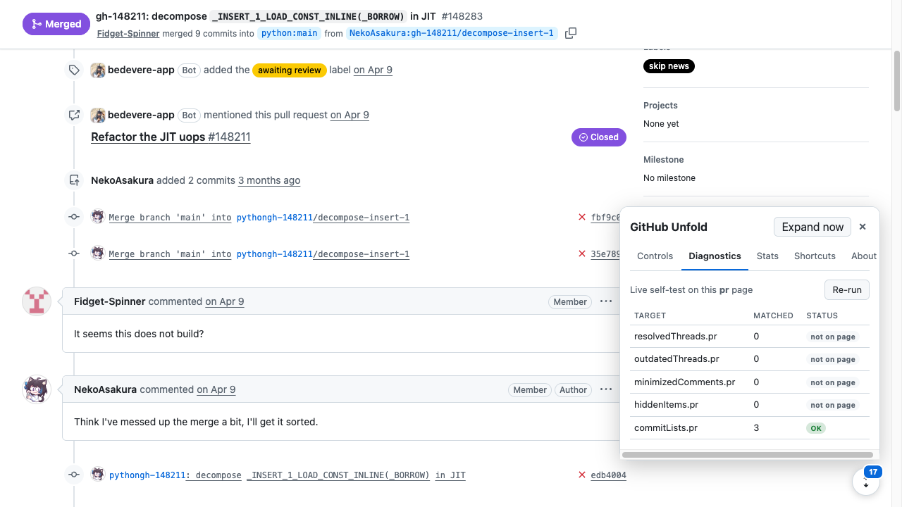
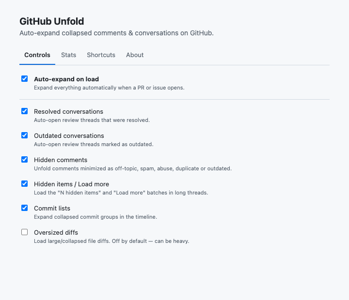
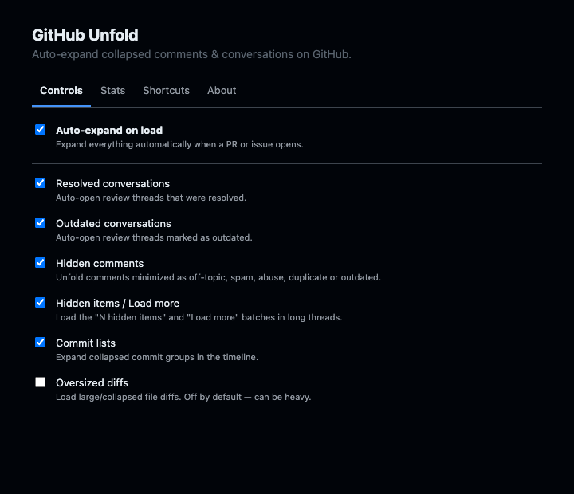

# GitHub Unfold

[](https://github.com/DjodyKort/github-unfold/actions/workflows/ci.yml)
[](https://github.com/DjodyKort/github-unfold/actions/workflows/sentinel.yml)
[](https://github.com/DjodyKort/github-unfold/actions/workflows/codeql.yml)
[](./LICENSE)

Zero-click expander for the stuff GitHub hides on pull requests and issues —
**resolved & outdated review threads**, **minimized/hidden comments**, and
**"N hidden items / Load more"** batches — with **live drift detection** and an
**AI self-healing** pipeline so broken selectors fix themselves.

> Why this exists: no existing tool does zero-click, both behaviors, on GitHub's
> current (2026) UI. `expand-everything` is zero-click but its resolved-thread
> selector broke in the April 2026 UI change; Refined GitHub is excellent but its
> bulk expand is a manual Alt+click. GitHub Unfold is the hybrid — automatic,
> complete, and built to survive GitHub's frequent DOM churn.

## Status

Working end-to-end. Zero-click expansion is verified against live GitHub PRs, and
the self-healing sentinel runs green daily. See the [roadmap](#roadmap).


The panel and live **Diagnostics**, sitting on a real PR:

| Panel                                              | Diagnostics (live self-test)                    |
| -------------------------------------------------- | ----------------------------------------------- |
|  |  |

| Dashboard (light)                                   | Dashboard (dark)                                  |
| --------------------------------------------------- | ------------------------------------------------- |
|  |  |

## Features

- **Zero-click auto-expand** on page load (with a master + per-category toggles)
- Correct **2026 selectors** (`review-thread-collapsible.open()` — the fix nobody shipped)
- Full category coverage: resolved / outdated threads, hidden comments, hidden
  items & Load-more, commit lists, (optional) oversized diffs
- Handles both **classic PR** markup and the **React Issue Viewer**
- **Rich dashboard** with a live **Diagnostics** view — see exactly which selector
  broke, the moment it breaks
- **Self-healing**: a scheduled sentinel checks real GitHub pages; on drift, Claude
  opens a ready-to-merge fix PR

## Install (development)

```bash
npm install
npm run dev        # launches a dev browser with the extension loaded
```

To build an unpacked extension:

```bash
npm run build      # output in .output/chrome-mv3
```

Then load `.output/chrome-mv3` via `chrome://extensions` → "Load unpacked".

## Development

```bash
npm run compile    # type-check
npm run lint       # ESLint
npm run format     # Prettier
npm test           # unit tests (every selector vs a saved fixture)
npm run e2e:ci     # hermetic extension E2E (loads the real build, no live GitHub)
npm run sentinel   # live drift check against real GitHub pages
npm run build      # production build (chrome) / build:firefox for Firefox
```

CI runs type-check, lint, format, a Node 20/22 test matrix with coverage, Chrome +
Firefox builds, and the hermetic extension E2E on every PR. A daily
[sentinel](#how-it-stays-alive-maintainability) checks live GitHub, and CodeQL +
Dependabot keep dependencies and code secure.

## How it stays alive (maintainability)

Every fragile piece of DOM knowledge lives in one typed **selector registry**
(`src/selectors/`). Each entry is unit-tested against a saved HTML **fixture** and
checked live by a **sentinel** workflow. When GitHub changes its markup and a
selector stops matching, the extension flags it (red badge + Diagnostics), and the
sentinel triggers an AI fix PR. See [`MAINTENANCE.md`](./MAINTENANCE.md).

## Roadmap

- [x] Phase 0 — Scaffold & foundation
- [x] Phase 1 — Playwright recon → selector registry + fixtures
- [x] Phase 2 — Core engine + expanders + unit tests
- [x] Phase 3 — Rich dashboard UI + diagnostics
- [x] Phase 4 — Self-healing pipeline
- [x] Phase 5 — Polish, packaging, docs
- [x] Phase 6 — E2E verification

## Project

- [CHANGELOG](./CHANGELOG.md)
- [Contributing](./CONTRIBUTING.md)
- [Maintenance & self-healing](./MAINTENANCE.md)
- [Selector map](./SELECTORS.md)
- [Security policy](./SECURITY.md)

## License

[MIT](./LICENSE) © Djody Kort
